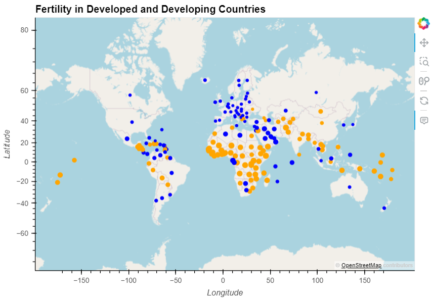
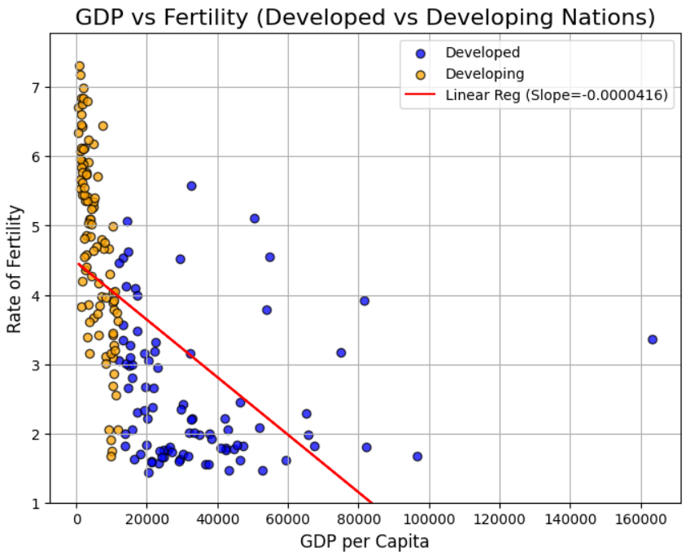

# development_vs_fertility
Authors: Saba Alaeddini, Vidushi Bundhooa, Aidan David
## Setup:

To download the required libraries, run the following in your console:
```sh
pip install -r requirements.txt
```

## Background:

In this project we will compare the fertility in developed vs developing countries. Using UN data we aim to draw conclusions based on a country's development and their fertility, contraceptive use, and infant survival rates. This will allow for an understanding of how human development may influence a society's perspective on sex and birth.

### Data:

Our data was taken from the UN database: http://data.un.org/Explorer.aspx

Some of the data was restricted by years and countries, thus much of the data centers around 2012 and may be missing a small quantity of countries.

How we got the Development (GDP per capita): UN Data --> World Development Indicators --> GDP per capita, PPP (current international $)

How we got the Fertility: UN Data --> World Fertility Data


### Our Research Questions:

Question 1: How do fertility rates differ in developed vs developing countries? (Aidan)


Question 2: How prevalent are contraceptives in developed countries vs developing countries? (Saba)


Question 3: How do ages of conception differ in developed vs developing countries? (Vidushi)

## Analysis:
### Question 1:


There is a clear correlation in both developed and developing countries where there is an increase in GDP per Capita, you see a decrease in the rate of fertility. That is to say, in general, that citizens of more developed and wealthy countries tend to have fewer children than citizens of less developed and less wealthy countries. The difference in fertility is most apparent amongst developing countries. Countries with GDP per capitas near the development boundary of $12,000 USD, have fertility rates (~2 to 4) dramatically lower than those at the very bottom of the global GDP valuations (~5 to 7). The Pearson correlation value (-0.5371), as well as the P-value (0.0000000000000023), both demonstrate a clear negative correlation between fertility and GDP per capita (development).


###Question 2:
Regarding to the tests that have been done like ANOVA, and based on F-statistic: 22.05155597911754 and P-value: 4.630506206795897e-27 results we can conclude:
*F-statistic of 22.05 suggests that there is a strong likelihood that at least one of the group means is significantly different from the others.
*p-value of 4.630506206795897e-27 is much smaller than the standard significance levels of 0.05 or 0.01. This means that there is an extremely small probability (practically negligible) that the observed result occurred by chance under the assumption that the null hypothesis is true. In other words, we can confidently reject the null hypothesis and conclude that there is a statistically significant difference between the means of the groups being compared.
As we can see in the bar chart and also the numerical value of the means for each method in developing and developed countries, we can conclude that the Pill with average usage of 15.86% is the most common contraceptive method in developed countries, on the other hand, in the developing countries Injectable method with average usage of 9.44% is the most common one


### Question 3:
Summary of Project/Abstract

DATA EXPLORATION

-The data above is obtained from the United Nations World Fertility Data 2012 which shows Age-specific fertility rates and Total fertility rate. This data was collected mainly by survey, census or registration. The data was partly cleaned by Aidan and the data above shows how it looks after merging.

-The age groups have been broken into 7 groups 7 age groups namely:  15-19, 20-24, 25-29, 30-34, 35-39, 40-44, 45-49. 

-The value of the Age-specific fertility rates (ASFRs) have been measured per 1,000 women in the age intervals. Each age group has an age interval of 5.

-The total fertility rate is calculated by adding all ASFRs for a particular country (row) and then multiplying by 0.005 (age interval/1000).

-Data cleaning part will delete all redundant columns and rows.

-Since we have more than one row of data for a particular country, only the row with the most recent year data will be kept.


DATA CLEANING

-This part involves removing all redundant rows and columns.

-Dropping all rows with NaN values

-Renaming columns suitably.

-Converting into proper data type for each column to perform aggregation.

-Keeping the most recent data if we have more than one complete row of data for a specific country.

-Calculating age specific fertility rate as we have only value per 1000 in 5 year interval.


1. INVESTIGATING THE RELATIONSHIP BETWEEN AGE GROUPS AND FERTILITY RATES FOR DEVELOPING AND DEVELOPED COUNTRIES

------HYPOTHESIS TESTING-------

Null Hypothesis: There is no correlation between mean age range and mean fertility rate

Alternate Hypothesis: There is a correlation between mean age range and mean fertility rate

Significance level: 0.05

Test used: Pearson's correlation

Visualisation: Creating a scatter plot to determine the correlation between the mean fertility rate and the age group for developed and developing countries


RESULT OF ANALYSIS
For developing countries:

The r value is -0.613, it indicates a negative correlation between the age groups and fertility rates. 
p value is 0.143 which is greater than 0.05. Hence, fail to reject null hypothesis. There is not enough evidence to support that there is a significant relationship between age group and fertility rates


For developed countries:

The r value is -0.485, which also indicates a negative correlation between the age groups and fertility rates. 
p value is 0.270 which is also greater than 0.05. Hence, fail to reject null hypothesis. There is not enough evidence to support that there is a significant relationship between age group and fertility rates

The scatter plot also suggests that there is a correlation as reflected by the line of regression. However, the way the points are scattered is in itself proof that we cannot detect any significant relationship. These are in line with our statistical analysis.


2. INVESTIGATING THE VARIATION IN FERTILITY RATES FOR DEVELOPING AMND DEVELOPED COUNTRIES FOR EACH AGE GROUP. Is there any significant difference between mean fertility rates for developing and developed countries?

------HYPOTHESIS TESTING-------

Null Hypothesis: There is a difference between the means of fertility rates for developing and developed countries

Alternate Hypothesis(one-tailed, right-tailed): The means of fertility rates is greater for developing countries than developed countries

Significance level: 0.05

Test used: Independent sample t-Test

Visualisation: Creating a stacked (overlayed) barchart to determine if there is a significant difference or not.


RESULTS OF ANALYSIS:

All p_values for different age groups are considerably less than the designated significance level of 0.05. Hence for all age groups, we reject the null hypothesis.This means that we have strong evidence that the means of fertility rates is greater for developing countries than developed countries

The barchart graph is a stacked barchart(overlayed) and this clearly demonstrates that the average value of fertility rates is higher for developing countries as compared to developed countries for all the age groups. The height of the bars for developing countries is almost twice that of developed countries.The bar chart is line with our statistical analysis.